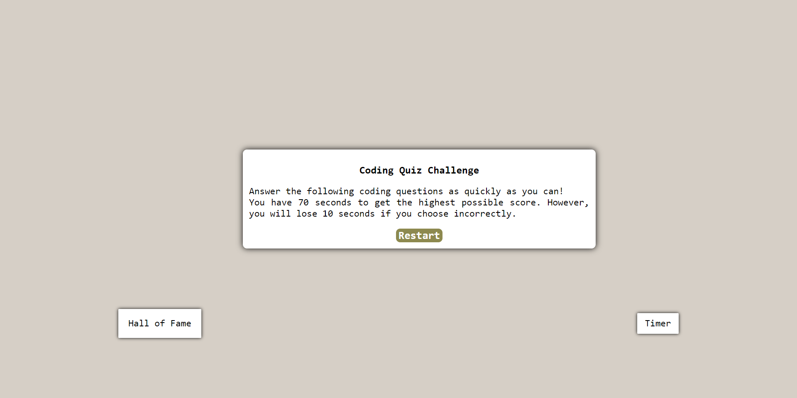

# Pop Quiz Time

## Description
The following application is a quick test on the user's code knowledge. 

If you want to join the 'Hall of Fame' click on the deployed URL and try it out!

-------------------

## Instructions
1. Click on the provided URL for the deployed site.
2. Click on "Start".
3. Select the option you think it's the correct answer but remember:
   
    - You have 50s to complete the test.
    - If your answer is incorrect, 10 seconds will be deducted from your reimaining time.

4. Enter your initials and submit your result.
5. Restart the quiz to try again or check the previous results.

## Installation

N/A

--------------------

## Submission Links

### Deployed URL: https://momoncada.github.io/pop-quiz-time/

### GitHub: https://github.com/MoMoncada/pop-quiz-time

---------------------

## Deployed Web Page
### Introduction Page

### Quiz Content

### Final Score Page

## Credits
Maria Auxiliadora Moncada 

------------

## License
N/A
